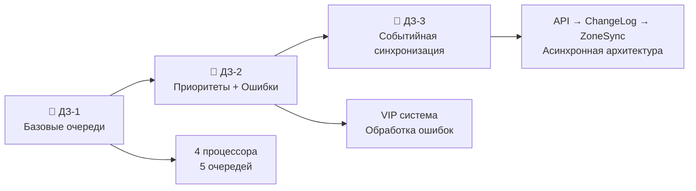
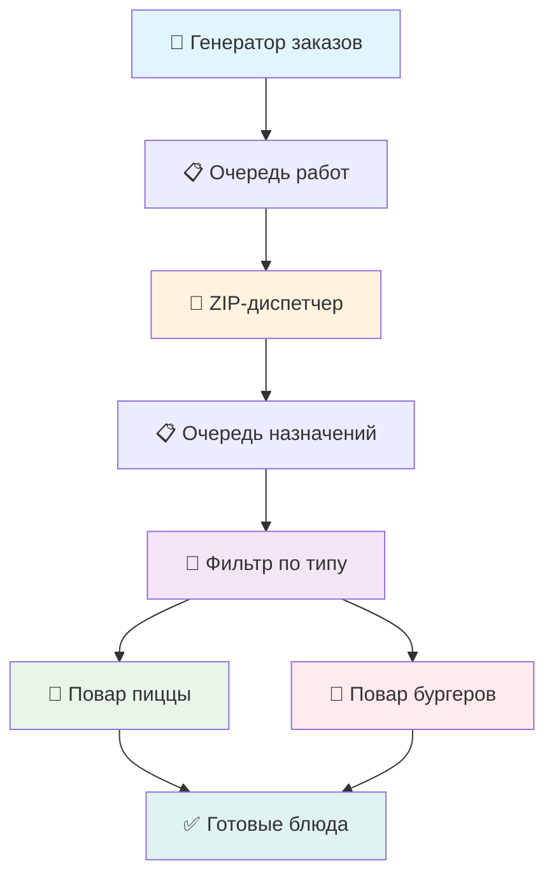
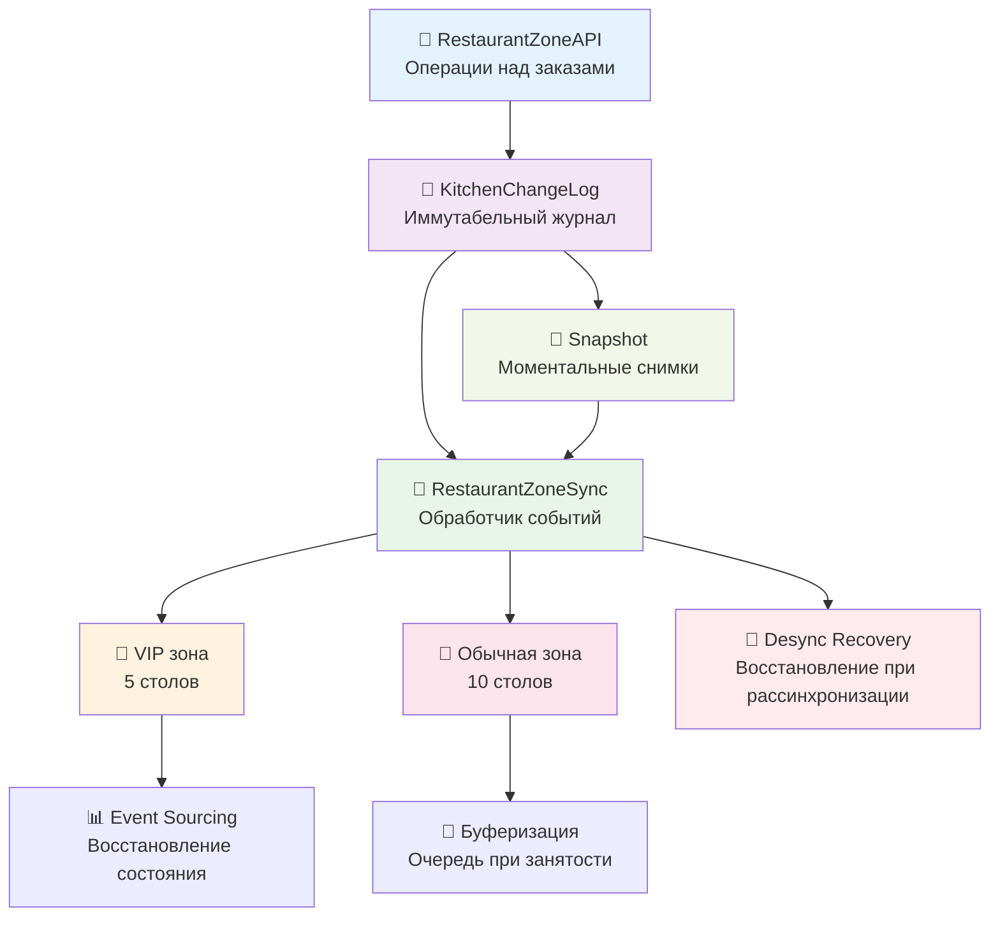

# 🏭 Event-Driven Architecture: CEP Demonstration


> 🎓 **Образовательная реализация принципов Complex Event Processing**

**Интерактивная демонстрация эволюции событийных систем через метафору ресторана "Событийная Кухня"**

[📚 **Документация**](./docs/) | [🎯 **Architecture**](./docs/ARCHITECTURE.md)

---

## 🎯 **Что это?**

Это **практическая реализация всех принципов CEP**, воплощенная через понятную метафору ресторана быстрого питания. Проект демонстрирует **эволюцию событийных систем** от простых очередей до сложной событийной синхронизации.

### 📈 **Эволюция системы:**



---

## ✅ **Реализованные домашние задания**

### **🏭 ДЗ-1: Базовая CEP система**

- ✅ **4 процессора** (Генератор → ZIP → Фильтр → Рабочие)
- ✅ **5 очередей событий** с блокирующими операциями
- ✅ **Функциональные процессоры** (чистые функции)
- ✅ **Неизменяемые события** с временным порядком
- ✅ **Producer-Consumer паттерн** через очереди

### **👑 ДЗ-2: Приоритеты и отказоустойчивость**

- ✅ **Приоритетные очереди** с формулой `(deadline - now) / cookingTime`
- ✅ **VIP система** с коэффициентом приоритета 0.5
- ✅ **6 типов ошибок поваров** с автоматической обработкой
- ✅ **7 стратегий восстановления** (Retry, Circuit Breaker, Fallback)
- ✅ **TDD покрытие** - 32 теста всей функциональности
- ✅ **QoS оптимизация** для критически важных заказов

### **🔄 ДЗ-3: Событийная синхронизация** ⭐ _Новое!_

**Согласно лекции №3 - реализована полная архитектура событийной синхронизации:**

- ✅ **RestaurantZoneAPI** - управление заказами через события (аналог таблиц узлов/ребер)
- ✅ **KitchenChangeLog** - иммутабельный журнал всех изменений с версионностью
- ✅ **RestaurantZoneSync** - синхронизация зон через обработку событий
- ✅ **Event Sourcing** - восстановление состояния из событий без потерь
- ✅ **Асинхронная архитектура** API → ChangeLog → ZoneSync → UI
- ✅ **Snapshot система** - моментальные снимки для быстрой синхронизации
- ✅ **Буферизация заказов** при отсутствии свободных столов (управление очередями)
- ✅ **Детальное логирование** событий столиков и очередей
- ✅ **Версионность событий** - предотвращение конфликтов и рассинхронизации
- ✅ **Восстановление после рассинхронизации** через replay событий

---

## 🍕 **Ресторанная метафора CEP**

Проект превращает абстрактные принципы CEP в **понятную кухню ресторана**:

| **Ресторан "Событийная Кухня"**        | **CEP Архитектура (ДЗ-3)** | **Принцип из лекции**                                |
| -------------------------------------- | -------------------------- | ---------------------------------------------------- |
| 📱 **Заказы через приложение**         | События                    | Неизменяемые, упорядочены по времени                 |
| 🤝 **Диспетчер кухни**                 | ZIP-процессор              | Объединяет заказы + свободных поваров                |
| 🔀 **Распределение по специализации**  | Фильтр-процессор           | Четные → Пицца, Нечетные → Бургеры                   |
| 👨‍🍳 **Повара (А: пицца, Б: бургеры)**   | Worker-процессоры          | Параллельная обработка заказов                       |
| 🎯 **Готовые блюда**                   | Результаты                 | Завершенные события                                  |
| 🏪 **VIP зона (5 столов)**             | Приоритетная обработка     | Event Sourcing + ZoneSync                            |
| 🏢 **Обычная зона (10 столов)**        | Стандартная обработка      | Буферизация при занятости                            |
| 📋 **Журнал кухни (ChangeLog)**        | KitchenChangeLog           | Иммутабельная история событий с версионностью        |
| 🔄 **Синхронизация зон**               | RestaurantZoneSync         | Обработчик событий для согласования состояний        |
| 📸 **Снимки состояния**                | Snapshot система           | Быстрая синхронизация новых клиентов                 |
| 🚨 **Восстановление рассинхронизации** | Replay механизм            | Восстановление состояния из ChangeLog при конфликтах |

---

## 🚀 **Быстрый старт**

### **Требования**

- **Node.js** 18+
- **npm** или **yarn**

### **Установка и запуск**

```bash
# Клонирование репозитория
git clone https://github.com/your-username/event-D-A.git
cd event-D-A

# Установка зависимостей
npm install

# 🔥 Запуск ресторана
npm run dev

# 🌐 Откройте http://localhost:3002
```

### **Доступные команды**

```bash
# 🧑‍💻 Разработка
npm run dev              # Запуск с hot-reload
npm run build            # Сборка для продакшена
npm run preview          # Предпросмотр сборки

# 🧪 Тестирование
npm test                 # Запуск всех тестов (98 проходящих)
npm run test:watch       # Тесты в режиме наблюдения
npm run test:coverage    # Покрытие кода тестами

# 🔍 Линтинг и качество
npm run lint             # Проверка TypeScript/Vue
npm run format           # Автоформатирование кода
```

---

## 🏗️ **Архитектура ДЗ-3: Двойная система**

### **🏭 Система 1: CEP Конвейер (ДЗ-1+2)**



### **🏪 Система 2: Событийные зоны (ДЗ-3)**

**Реализация согласно лекции №3**



### **🔗 Интеграция систем согласно ДЗ-3:**

- **CEP Конвейер** обрабатывает поток заказов через приоритетные очереди
- **Событийные зоны** управляют размещением готовых заказов по столикам через **ChangeLog**
- **Единый UI** показывает обе системы в реальном времени с **детальными логами**
- **Event Sourcing** обеспечивает согласованность состояний между компонентами
- **Snapshot система** позволяет быстро синхронизировать новые клиенты
- **Восстановление после рассинхронизации** через replay событий из ChangeLog

---

## 📊 **Что демонстрирует проект (согласно ДЗ-3)**

### **🎓 Для изучающих CEP:**

- **Event Sourcing** - восстановление состояния из событий (ChangeLog → ZoneSync)
- **Stream Processing** - обработка непрерывного потока данных
- **Temporal Consistency** - согласованность по времени через версионность
- **Backpressure Handling** - управление перегрузкой через буферы
- **Fault Tolerance** - отказоустойчивость через Circuit Breaker
- **Event-driven Architecture** - полностью асинхронная система
- **Снимки состояния (Snapshots)** - быстрая синхронизация клиентов
- **Восстановление после рассинхронизации** - replay механизм

### **👨‍💻 Для разработчиков:**

- **Clean Architecture** с разделением слоев
- **Domain-Driven Design** через ресторанную метафору
- **TDD подход** - тесты написаны до реализации
- **TypeScript best practices** - строгая типизация
- **Vue 3 Composition API** - современный фронтенд
- **Functional Programming** элементы

### **🔧 Для архитекторов:**

- **Microservices patterns** через модульную структуру
- **Event-driven integration** между компонентами
- **CQRS принципы** (разделение команд и запросов)
- **Saga паттерн** для сложных бизнес-процессов
- **Distributed systems** симуляция через зоны
- **Event Sourcing + CQRS** - полная реализация

---

## 📁 **Структура проекта (обновленная для ДЗ-3)**

```
event-D-A/
├── 📚 docs/                          # Документация
│   ├── ARCHITECTURE.md               # Архитектура системы
│   ├── CEP_PRINCIPLES.md             # Принципы CEP
│   └── design-system-tokens.mdc      # Дизайн-система
├── 🏭 src/modules/WorkloadBalancing/  # Бизнес-логика CEP
│   ├── services/
│   │   ├── workloadSystem.ts         # Координация системы
│   │   ├── restaurantZoneAPI.ts      # 🆕 API управления заказами (ДЗ-3)
│   │   ├── kitchenChangeLog.ts       # 🆕 Журнал событий (ДЗ-3)
│   │   ├── restaurantZoneSync.ts     # 🆕 Синхронизация зон (ДЗ-3)
│   │   └── workloadProcessors.ts     # Функциональные процессоры
│   ├── interfaces/
│   │   ├── IRestaurantSyncModel.ts   # 🆕 Интерфейсы ДЗ-3
│   │   ├── IWorkItem.ts              # Базовые интерфейсы
│   │   └── index.ts                  # Экспорт интерфейсов
│   └── __tests__/                    # 98 TDD тестов (включая ДЗ-3)
├── 🎨 src/modules/WebDashboard/       # Образовательный UI
│   ├── components/
│   │   ├── ModernDashboard.vue       # Главный дашборд
│   │   ├── RestaurantZoneVisualizer.vue  # 🆕 Визуализация зон (ДЗ-3)
│   │   └── RestaurantOrderCard.vue   # Карточка заказа
│   └── composables/
│       ├── useRestaurantVisualizer.ts    # CEP система
│       └── useRestaurantSync.ts          # 🆕 Событийная синхронизация (ДЗ-3)
└── 🌐 src/web/                       # Web приложение
    ├── main.ts                       # Точка входа
    └── style.css                     # Минималистичная тема
```

---

## 🧪 **Тестирование (TDD подход) - 98 тестов**

### **98 проходящих тестов:**

**✅ ДЗ-1: Базовая система (15 тестов)**

- Генератор работ
- ZIP-процессор
- Фильтр-процессор
- Рабочие процессоры
- Очереди событий

**✅ ДЗ-2: Приоритеты + Ошибки (32 теста)**

- Приоритетные очереди (15 тестов)
- Обработка ошибок поваров (17 тестов)

**✅ ДЗ-3: Событийная синхронизация (51 тест)** 🆕

**Согласно требованиям лекции №3:**

- **RestaurantZoneAPI (17 тестов)** - операции add/remove/change с ChangeLog
- **KitchenChangeLog (16 тестов)** - иммутабельный журнал с версионностью
- **RestaurantZoneSync (18 тестов)** - синхронизация состояний, Snapshot, Recovery

```bash
# Запуск всех тестов
npm test

# Тесты по модулям
npm test WorkloadBalancing  # ДЗ-1+2+3
npm test WebDashboard       # UI логика

# Покрытие кода
npm run test:coverage       # >95% покрытие
```

---

## 🎨 **Дизайн-система**

### **Минималистичная монохромная палитра:**

- **12 оттенков серого** - основа без отвлечений
- **Стратегические акценты** только для смысловой нагрузки:
  - 🔴 **Критические**: ошибки, просроченные заказы
  - 🟡 **Предупреждения**: VIP заказы, близкие дедлайны
  - 🟢 **Успех**: готовые блюда, завершенные операции
  - 🔵 **Информация**: метрики, подсказки, статистика

### **Принципы UI:**

- **Fira Code** - моноширинный шрифт
- **Без скруглений** - четкие геометрические формы
- **Высокий контраст** - отличная читаемость
- **Компактные формы** - размещение над контентом
- **Иконки вместо текста** - Lucide Icons

---

## 📚 **Образовательная ценность (ДЗ-3)**

### **🎯 Принципы CEP в действии согласно лекции №3:**

**1. Event Sourcing (ДЗ-3)**

```typescript
// Заказ создается через API и фиксируется в ChangeLog
const event = await restaurantAPI.addOrder({
  orderId: 42,
  isVipCustomer: true,
  dishDescription: "Пицца Маргарита",
  tablePreference: "VIP",
});

// Событие становится неизменяемым в ChangeLog
await kitchenChangeLog.append(event);
```

**2. ChangeLog система (ДЗ-3)**

```typescript
// Иммутабельный журнал всех изменений
interface ChangeLogEntry {
  id: string;
  timestamp: Date;
  eventType: "order_added" | "order_moved" | "table_occupied";
  version: number; // Предотвращение конфликтов
  payload: any; // Данные события
  previousHash?: string; // Целостность цепочки
}
```

**3. Синхронизация состояний (ДЗ-3)**

```typescript
// RestaurantZoneSync обрабатывает события и синхронизирует зоны
class RestaurantZoneSync {
  async processEvent(event: ChangeLogEntry): Promise<void> {
    switch (event.eventType) {
      case "order_added":
        await this.assignToTable(event.payload);
        break;
      case "table_freed":
        await this.processQueuedOrders();
        break;
    }

    // Уведомляем UI о изменениях
    this.notifyStateChanged();
  }
}
```

**4. Snapshot система (ДЗ-3)**

```typescript
// Моментальные снимки для быстрой синхронизации
interface RestaurantSnapshot {
  timestamp: Date;
  version: number;
  vipZoneState: TableState[];
  regularZoneState: TableState[];
  pendingOrders: OrderQueue;
  lastProcessedEventId: string;
}
```

**5. Восстановление после рассинхронизации (ДЗ-3)**

```typescript
// Replay событий при обнаружении рассинхронизации
async recoverFromDesync(lastKnownVersion: number): Promise<void> {
  const events = await this.changeLog.getEventsAfter(lastKnownVersion);

  for (const event of events) {
    await this.processEvent(event);
  }

  this.markSynchronized();
}
```

---

## 🤝 **Contributing**

Проект создан в образовательных целях. Приветствуются:

- 🐛 **Баг-репорты** с детальным описанием
- 💡 **Предложения улучшений** архитектуры CEP
- 📚 **Дополнения документации** с примерами
- 🧪 **Новые тесты** для edge cases
- 🎨 **Улучшения UI/UX** для лучшего понимания

### **Правила разработки:**

- **TDD First** - тесты пишутся до реализации
- **Conventional Commits** - `feat:`, `fix:`, `docs:`, `test:`
- **TypeScript строго** - без `any`, все типизировано
- **CEP принципы** - события неизменяемы, порядок важен

---

## 📄 **Лицензия**

MIT License - свободно используйте для изучения CEP и событийных архитектур.

---

## 🎓 **Благодарности**

**Проект создан для демонстрации домашних заданий №1, №2, №3**  
**по курсу "Complex Event Processing"**

### **Реализованные концепции из лекции №3:**

- ✅ **Таблицы состояний** (узлы и ребра) → Столики и заказы
- ✅ **ChangeLog система** → KitchenChangeLog с версионностью
- ✅ **Event Sourcing** → Восстановление состояния зон из событий
- ✅ **Синхронизация клиент-сервер** → ZoneSync с UI
- ✅ **Snapshot механизм** → Быстрая синхронизация состояний
- ✅ **Восстановление рассинхронизации** → Replay событий при конфликтах
- ✅ **Очереди с буферизацией** → Управление заказами при занятости столов

**🍕 Ресторан "Событийная Кухня" - где события становятся понятными!**

---

## 📈 **Roadmap**

- [ ] **v1.1.0** - Метрики производительности и мониторинг
- [ ] **v1.2.0** - Интерактивные туториалы по CEP принципам
- [ ] **v1.3.0** - Расширенная обработка ошибок с Saga паттерном
- [ ] **v2.0.0** - Распределенная версия с несколькими ресторанами
