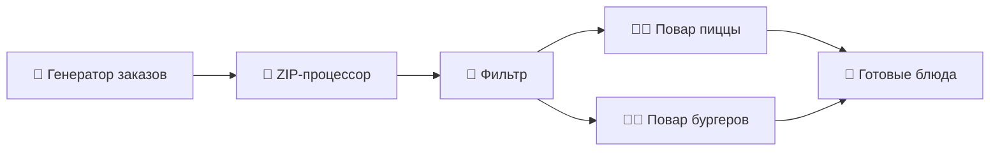

# 🏭 CEP Restaurant Demo


Интерактивная демонстрация принципов **Complex Event Processing (CEP)** через метафору ресторана быстрого питания.

## 🎯 О проекте

Этот проект представляет собой образовательную визуализацию событийных систем, где абстрактные концепты CEP представлены через понятную метафору ресторана:

- **📱 Заказы клиентов** → События в системе
- **🤝 Диспетчер кухни** → ZIP-процессор (объединяет потоки)
- **👨‍🍳 Повара** → Рабочие процессоры
- **🎯 Готовые блюда** → Результаты обработки
- **🔄 Очереди кухни** → Буферизация событий

## ✨ Особенности

- 🎮 **Интерактивная визуализация** - наблюдайте за событиями в реальном времени
- 🧪 **TDD подход** - полное покрытие тестами всех компонентов
- 🎨 **Современный UI** - два интерфейса на Tailwind CSS
- ⚡ **Event-driven архитектура** - полностью асинхронная система
- 🔧 **Модульная структура** - разделение бизнес-логики и UI
- 📝 **Функциональное программирование** - использование Ramda.js

## 🚀 Быстрый старт

### Требования

- **Node.js** 18+
- **npm** или **yarn**

### Установка

```bash
# Клонирование репозитория
git clone <repository-url>
cd event-D-A

# Установка зависимостей
npm install

# Запуск приложения
npm run dev

# Откройте http://localhost:3002
```

### Доступные команды

```bash
# Разработка
npm run dev              # Запуск с автоперезагрузкой
npm run dev:demo         # Запуск с информационным сообщением

# Тестирование
npm test                 # Запуск всех тестов
npm run test:watch       # Тесты в watch режиме
npm run test:coverage    # Тесты с покрытием
npm run test:ui          # UI для тестирования

# Продакшн
npm run build            # Сборка для продакшн
npm run preview          # Предпросмотр сборки
```

## 🏗️ Архитектура системы

### Событийный конвейер (4 участка)



### 5 очередей событий

1. **📱 Новые заказы** - поток входящих заказов
2. **👥 Свободные повара** - циркулирующие заявки "я свободен"
3. **🤝 Назначения** - ZIP объединяет заказы + поваров
4. **🍕 Очередь повара пиццы** - четные заказы
5. **🍔 Очередь повара бургеров** - нечетные заказы

## 🎨 Интерфейсы

### 🍕 Кухня ресторана

Минималистичный интерфейс для наблюдения за процессом:

- Живые очереди поваров с анимацией
- Лог событий в реальном времени
- Простая метрика эффективности

### 📊 Аналитический дашборд

Подробная визуализация всей CEP системы:

- Анимированный конвейер обработки данных
- Цветовая кодировка заказов (синие/красные)
- Детальная статистика и метрики
- Полный лог событий с фильтрами

## 📁 Структура проекта

```
src/
├── modules/
│   ├── WorkloadBalancing/          # 🔧 Бизнес-логика CEP системы
│   │   ├── services/               # Процессоры и основная система
│   │   ├── interfaces/             # TypeScript интерфейсы
│   │   └── __tests__/             # Модульные TDD тесты
│   └── WebDashboard/              # 🎨 UI компоненты и визуализация
│       ├── components/            # Vue компоненты (Tailwind CSS)
│       ├── composables/           # Композаблы для UI логики
│       ├── interfaces/            # UI интерфейсы
│       └── __tests__/             # Тесты композаблов
├── shared/                        # 🔗 Общая инфраструктура
│   └── infrastructure/            # EventQueue, базовые компоненты
└── web/                          # 🌐 Точка входа приложения
    ├── index.html                # HTML шаблон
    ├── main.ts                   # Инициализация Vue приложения
    └── style.css                 # Глобальные стили
```

## 🛠️ Технологический стек

### Frontend

- **Vue 3** - реактивный фреймворк с Composition API
- **TypeScript** - типизированный JavaScript для надежности
- **Tailwind CSS 4** - utility-first CSS фреймворк
- **Vite** - быстрый modern bundler

### Логика и архитектура

- **Ramda.js** - функциональное программирование
- **Event-driven patterns** - async/await для событийной архитектуры
- **Модульная архитектура** - разделение ответственности

### Тестирование

- **Vitest** - современный test runner
- **TDD подход** - сначала тесты, потом код
- **100% покрытие** - всех бизнес-компонентов

## 🎓 Образовательные цели

Проект демонстрирует ключевые концепции:

### CEP принципы

- **Event Sourcing** - все изменения как события
- **Stream Processing** - обработка потоков в реальном времени
- **Backpressure handling** - управление нагрузкой через очереди
- **Time consistency** - временная согласованность вместо строгой

### Архитектурные паттерны

- **CQRS** - разделение команд и запросов
- **Publisher-Subscriber** - событийная коммуникация
- **Pipeline pattern** - последовательная обработка
- **Actor model** - изолированные процессоры

### Инженерные практики

- **TDD** - разработка через тестирование
- **Functional Programming** - иммутабельность и чистые функции
- **Модульность** - слабая связанность компонентов
- **Type Safety** - TypeScript для надежности

## 🧪 Тестирование

Проект использует комплексный подход к тестированию:

```bash
# Запуск всех тестов
npm test

# Покрытие тестами
npm run test:coverage

# Интерактивная разработка тестов
npm run test:watch
```

### Покрытие тестами:

- ✅ **EventQueue** - очереди событий
- ✅ **WorkloadSystem** - основная система
- ✅ **Все процессоры** - ZIP, Filter, Worker, Generator
- ✅ **Композаблы Vue** - UI логика
- ✅ **Интеграционные тесты** - полные сценарии

## 🤝 Вклад в проект

1. Форкните репозиторий
2. Создайте feature-ветку: `git checkout -b feature/new-feature`
3. Зафиксируйте изменения: `git commit -m 'Add new feature'`
4. Отправьте в ветку: `git push origin feature/new-feature`
5. Откройте Pull Request

### Гайдлайны

- Следуйте TDD подходу - сначала тесты
- Используйте TypeScript и JSDoc комментарии
- Пишите понятные commit сообщения
- Покрывайте новую функциональность тестами

## 📄 Лицензия

Этот проект создан в образовательных целях. Свободно используйте для изучения CEP и событийных систем.

## 🔗 Полезные ссылки

- [Vue 3 Composition API](https://vuejs.org/guide/extras/composition-api-faq.html)
- [Event-driven Architecture](https://microservices.io/patterns/data/event-driven-architecture.html)
- [Complex Event Processing](https://en.wikipedia.org/wiki/Complex_event_processing)
- [Functional Programming in JS](https://ramdajs.com/)

---

_Созданоь с ❤️ для изучения современных событийных архитектур_
