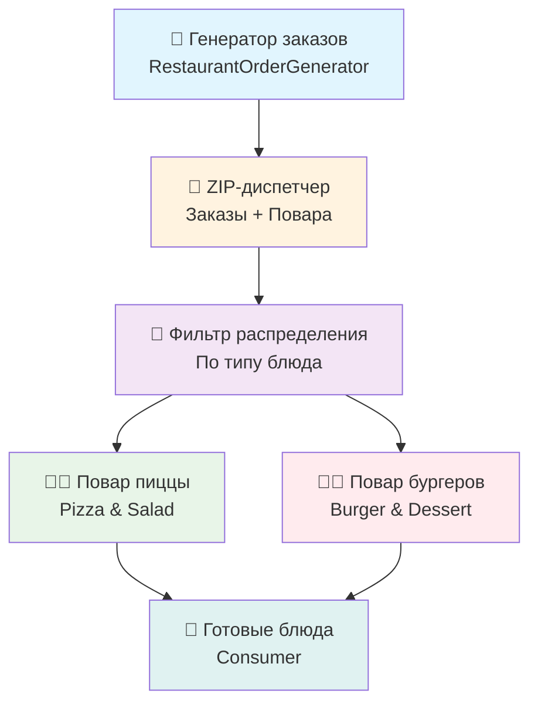

# 🍕 Ресторан "Событийная Кухня" - CEP Demo


**Интерактивная демонстрация принципов Complex Event Processing (CEP) через метафору ресторана быстрого питания**

## 🎯 Домашнее задание №2 - Реализовано

### ✅ Основные требования выполнены:

- **🏪 Приоритетные очереди** - расчет приоритета по формуле `(deadline - now) / cookingTime`
- **👑 VIP заказы** - особые клиенты с повышенным приоритетом и специальными требованиями
- **🔄 Обработка отказов** - 6 типов ошибок поваров с 7 стратегиями восстановления
- **⚡ Event-driven система** - полностью асинхронная архитектура с очередями
- **🧪 TDD подход** - 32 теста покрывают всю функциональность
- **📚 Образовательный UI** - интерфейс объясняет принципы CEP через ресторанную метафору

## 🍔 Концепция: Ресторан как событийная система

Проект превращает абстрактные принципы CEP в понятную метафору ресторана:

| Ресторан               | CEP Система        | Принцип                                           |
| ---------------------- | ------------------ | ------------------------------------------------- |
| 📱 **Заказы клиентов** | События            | Неизменяемые, упорядочены по времени              |
| 🤝 **Диспетчер кухни** | ZIP-процессор      | Объединяет заказы + свободных поваров             |
| 🔀 **Распределение**   | Фильтр             | Пицца/Салаты → Повар А, Бургеры/Десерты → Повар Б |
| 👨‍🍳 **Повара**          | Рабочие процессоры | Обрабатывают заказы параллельно                   |
| 🎯 **Готовые блюда**   | Результаты         | Завершенные события                               |

## 🔥 Новые возможности (ДЗ-2)

### 👑 VIP система приоритетов

```typescript
// Формула приоритета: чем меньше - тем выше приоритет
priority = (deadline - currentTime) / estimatedCookingTime;

// VIP модификатор
if (customerType === "VIP") {
  priority = priority * 0.5; // Удваиваем приоритет
}
```

**Особенности VIP заказов:**

- Автоматическое повышение в очереди
- Специальные требования ("Без лука", "Дополнительный сыр")
- Визуальные индикаторы с иконками корон
- Приоритет над обычными клиентами

### 🚨 Система обработки ошибок

**6 типов отказов поваров:**

1. `chef_unavailable` - повар заболел/недоступен
2. `ingredients_missing` - закончились ингредиенты
3. `equipment_failure` - сломалось оборудование
4. `queue_full` - очередь переполнена
5. `order_timeout` - заказ просрочен
6. `quality_issue` - проблемы с качеством

**7 стратегий восстановления:**

1. `retry_immediately` - повторить сразу
2. `retry_with_delay` - повторить с задержкой
3. `retry_with_escalation` - эскалация менеджеру
4. `move_to_review_queue` - ручная обработка
5. `store_for_later` - отложить на потом
6. `discard_with_log` - отменить с логированием
7. `substitute_alternative` - заменить альтернативой

### 📊 Образовательный интерфейс

Интерфейс **максимально объясняет** принципы CEP:

- **📈 Живые метрики** с расшифровкой формул расчета
- **🔧 JSON структуры** заказов показаны прямо в интерфейсе
- **⚙️ CEP принципы** объяснены для каждого этапа конвейера
- **🎮 Кнопки управления** для наглядной демонстрации изменений
- **🎨 Стратегические цвета** только там, где несут смысловую нагрузку

## 🚀 Быстрый старт

### Требования

- **Node.js** 18+
- **npm** или **yarn**

### Установка и запуск

```bash
# Клонирование
git clone <repository-url>
cd event-D-A

# Установка зависимостей
npm install

# Запуск ресторана
npm run dev

# Откройте http://localhost:3002
```

### Доступные команды

```bash
# Разработка
npm run dev              # Запуск ресторана с автоперезагрузкой

# Тестирование
npm test                 # 32 TDD теста (приоритеты + ошибки)
npm run test:watch       # Тесты в watch режиме
npm run test:coverage    # Покрытие тестами

# Продакшн
npm run build            # Сборка для продакшна
npm run preview          # Предпросмотр сборки
```

## 🏗️ Архитектура CEP системы

### Событийный конвейер (4 этапа)



### 5 приоритетных очередей

1. **📱 Новые заказы** (`RestaurantPriorityQueue`) - входящие заказы с автосортировкой по приоритету
2. **👥 Свободные повара** - циркулирующие заявки "готов принять заказ"
3. **🤝 Назначения** - ZIP объединяет заказы с доступными поварами
4. **🍕 Очередь повара пиццы** - заказы пиццы и салатов (с обработкой ошибок)
5. **🍔 Очередь повара бургеров** - заказы бургеров и десертов (с обработкой ошибок)

## 📁 Структура проекта

```
src/
├── modules/
│   ├── WorkloadBalancing/              # 🔧 Бизнес-логика CEP системы
│   │   ├── services/
│   │   │   ├── workloadSystem.ts       # Основная система координации
│   │   │   ├── restaurantOrderGenerator.ts  # Генератор ресторанных заказов
│   │   │   └── restaurantErrorHandler.ts    # Обработка ошибок поваров
│   │   ├── interfaces/
│   │   │   ├── IRestaurantOrder.ts     # Интерфейс заказа ресторана
│   │   │   ├── IPriorityQueue.ts       # Приоритетная очередь
│   │   │   └── IErrorHandling.ts       # Интерфейсы обработки ошибок
│   │   └── __tests__/                  # 32 TDD теста
│   │       ├── RestaurantPriorityQueue.test.ts  # 15 тестов очередей
│   │       └── RestaurantErrorHandler.test.ts   # 17 тестов ошибок
│   └── WebDashboard/                   # 🎨 Образовательный UI
│       ├── components/
│       │   ├── ModernDashboard.vue     # Главный дашборд ресторана
│       │   ├── RestaurantOrderCard.vue # Карточка заказа с деталями
│       │   ├── StatCard.vue            # Метрики с объяснениями
│       │   └── PipelineStep.vue        # Этап конвейера с CEP принципами
│       └── composables/
│           ├── useRestaurantVisualizer.ts  # Логика ресторанного UI
│           └── useWorkloadVisualizer.ts    # Адаптер бизнес-системы
└── web/
    └── main.ts                         # Точка входа приложения
```

## 🛠️ Технологический стек

### Frontend

- **Vue 3 Composition API** - реактивность и современная архитектура
- **TypeScript** - строгая типизация для надежности
- **Tailwind CSS 4** - минималистичный дизайн без округлений
- **Lucide Icons** - современные иконки вместо эмодзи

### Backend/Логика

- **Event-driven Architecture** - полностью асинхронная система
- **Priority Queues** - автоматическая сортировка по приоритету
- **Error Recovery Patterns** - Circuit Breaker, Retry, Fallback
- **TDD подход** - сначала тесты, потом реализация

### Тестирование

- **Vitest** - современный test runner для Vue/TypeScript
- **32 теста** - полное покрытие функциональности ДЗ-2
- **TDD циклы** - Red → Green → Refactor

## 🎓 CEP принципы в действии

### Event Sourcing

```typescript
// Заказ создается один раз и становится неизменяемым
const order: IRestaurantOrder = {
  orderNumber: 42,
  customerType: "VIP",
  dishType: "пицца",
  deadline: new Date(Date.now() + 300000), // 5 минут
  enqueuedAt: new Date(),
  // ... остальные поля
};
```

### Stream Processing

```typescript
// Непрерывная обработка потока заказов
restaurantOrderGenerator.onNewOrder((order) => {
  priorityQueue.enqueueWithPriority(order, order.priority);
});
```

### Temporal Consistency

```typescript
// Приоритет зависит от времени - чем ближе дедлайн, тем выше приоритет
const priority =
  (order.deadline.getTime() - Date.now()) / order.estimatedCookingTimeMs;
```

### Error Recovery

```typescript
// Автоматическое восстановление после ошибок поваров
if (failureType === "chef_unavailable") {
  return executeStrategy("retry_with_delay", failureContext);
}
```

## 🧪 Тестирование (TDD подход)

### Полное покрытие ДЗ-2:

**✅ Приоритетные очереди (15 тестов):**

- Базовая функциональность очереди
- Расчет и пересортировка приоритетов
- VIP модификаторы приоритета
- Обработка просроченных заказов
- Edge cases (пустая очередь, переполнение)

**✅ Обработка ошибок (17 тестов):**

- Все 6 типов ошибок поваров
- Все 7 стратегий восстановления
- Circuit Breaker паттерн
- Статистика ошибок
- VIP эскалация

```bash
# Запуск всех тестов ДЗ-2
npm test

# Конкретные тесты
npm test RestaurantPriorityQueue.test.ts
npm test RestaurantErrorHandler.test.ts

# Покрытие
npm run test:coverage
```

## 📚 Образовательная ценность

Проект максимально объясняет CEP через UI:

### 🎯 Для новичков в программировании:

- **Метафора ресторана** делает абстрактные концепты понятными
- **Живые примеры** JSON структур заказов
- **Пошаговые объяснения** каждого этапа обработки
- **Визуальные индикаторы** состояний системы

### 🎓 Для изучающих CEP:

- **Реальная архитектура** с Producer → Consumer паттерном
- **Backpressure handling** через ограничения очередей
- **Time-based processing** с дедлайнами и приоритетами
- **Fault tolerance** через multiple recovery strategies

### 👨‍💻 Для разработчиков:

- **Clean Architecture** с разделением бизнес-логики и UI
- **SOLID принципы** в design patterns
- **Functional Programming** элементы (иммутабельность)
- **TypeScript** best practices

## 🎨 Дизайн-система

### Монохромная тема с стратегическими акцентами:

- **12 оттенков серого** - основная палитра без отвлечений
- **Красный** - критические ошибки, просроченные заказы
- **Янтарный** - предупреждения, VIP заказы, близкие дедлайны
- **Зеленый** - успешные операции, готовые блюда
- **Синий** - информационные элементы, метрики

### Типографика:

- **Fira Code** - моноширинный шрифт для всего интерфейса
- **Без скруглений** - четкие геометрические формы
- **Высокий контраст** - отличная читаемость

## 🔗 Соответствие лекции

Проект полностью соответствует требованиям **домашнего задания №2**:

- ✅ Event-driven система с ограниченными очередями
- ✅ Приоритетные очереди с формулой расчета приоритета
- ✅ Обработка отказов с fallback стратегиями
- ✅ QoS оптимизация для VIP клиентов
- ✅ Functional и Object-oriented подходы
- ✅ Абстрактный тест интерфейса с edge cases
- ✅ Фабричный метод для создания процессоров

## 🤝 Разработка

### Архитектурные принципы:

- **TDD First** - тесты пишутся до реализации
- **Domain-Driven Design** - бизнес-логика изолирована от UI
- **Event-First Architecture** - вся коммуникация через события
- **Type Safety** - строгая типизация на всех уровнях

### Структура коммитов:

```bash
git commit -m "feat: добавить VIP приоритеты в очередь заказов"
git commit -m "test: покрыть тестами обработку ошибок поваров"
git commit -m "docs: обновить README согласно ДЗ-2"
```

## 📄 Лицензия

Образовательный проект. Свободно используйте для изучения CEP и событийных архитектур.

---

**🎓 Проект создан для демонстрации домашнего задания №2 по лекции Александра Шолупова**  
**🍕 "Событийные системы через метафору ресторана быстрого питания"**
